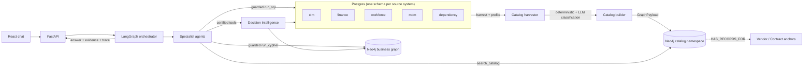

# Vendor Decision Intelligence: Implementation Plan

This is the index for this repository's instructions. It holds the shared
context: architecture, current state, invariants, configuration and verification.
Each phase has its own `phase_0N_*.md` file (see [§4](#4-phases)). Together they
replace the earlier phased plan (`instructions/00`..`10`) and the per-layer
runbooks, which can be recovered from git history at commit `81ceae0`.

**How to work:** do one phase at a time, stop at its gate, and get review before
starting the next phase. The invariants in §3 apply to every phase. The dashboard
is out of scope for now.

**Repository layout (since 2026-09-30):**
- `backend/` is the Python project: `pyproject.toml`, `uv.lock`, `src/`, `tests/`, `ontology/`, `langgraph.json` and the git-ignored `.env`.
- `frontend/` is the chat UI (Phase 4).
- `initial_plan/` (the shared data pack) and `instructions/` stay at the repository root.

Code paths in the phase files (`src/…`, `tests/…`, `ontology/…`) are relative to
`backend/`, and every `uv` command runs from `backend/`.

---

## 1. Goal and target architecture

We are building a read-only vendor decision-support platform. Users ask a chat
assistant business questions. An orchestrator hands each question to specialist
agents. The agents use a **metadata knowledge graph** to decide *which source
holds the information*, fetch it through governed tools, and return an answer
with evidence.

The four near-term goals:

1. **PostgreSQL** holds the structured business facts. Each source system is
   simulated as its own Postgres schema.
2. **Metadata ingestion** harvests business and column information from Postgres
   into Neo4j. When a dataset's records can be tied to contracts or vendors, it
   links them.
3. **Catalog-driven agents.** Sub-agents receive the question and task from a
   LangGraph orchestrator. They call their certified tool, then explore:
   - they find sources in the metadata graph
   - they write guarded, read-only SQL and Cypher
   - they retry, and follow foreign-key links to related records
4. **Chat UI.** It shows the answer, the evidence behind every fact and which
   agents, tools and sources were used.

### Design principle: the graph is an index, not a warehouse

At enterprise scale (10–15 systems such as SAP, Coupa, Ariba, Fieldglass, Icertis,
Sirion and TPRM), every fact must **not** be copied into one graph.

| Information | Scale at a bank | Where it lives |
|---|---|---|
| Metadata: systems, datasets, columns, domains, owners, lineage, freshness | 10³–10⁵ nodes | **Neo4j (catalog)** |
| Master identities: vendor, contract, app, OU, product, source-system crosswalks | 10⁴–10⁶ nodes | **Neo4j (thin anchor layer)** |
| Facts: GL lines, spend, POs, timesheets, SLA readings | 10⁸+ rows | **PostgreSQL** (later a lakehouse or marts) |
| Contract and policy text | 10⁶+ chunks | Vector store with entitlement filters (future phase) |

The division of responsibility:

- The **data layer** owns the facts.
- The **graph** owns relationships, metadata and provenance.
- The **semantic and decision services** own deterministic calculations.
- **LLM agents** own understanding, routing and explanation.



---

## 2. Current state (branch `feature/neo4j-knowledge-graph`, commit `81ceae0`)

These layers are built:

| Layer | Location | Role |
|---|---|---|
| Ontology | `ontology/*.yaml`, `services/ontology/` | Source of truth for classes, properties and relations. `ontology_version` is a SHA-256 hash of its content. |
| Knowledge graph | `services/knowledge_graph/` | Namespace-scoped, idempotent ingestion (`KnowledgeGraphService`), validation, fixed-Cypher `KnowledgeGraphQueryService`, deterministic `ask.py`, and the `citi-kg` CLI. |
| Structured data | `services/structured_data/query_service.py` | Loads 8 CSV and mapping files eagerly, validates them, and does exact decimal maths. |
| Semantic | `services/semantic_service.py` | Combines structured facts, graph relationships and evidence into business context. |
| Decision intelligence | `services/decision_intelligence.py` | Six deterministic capabilities: vendor 360, renewal priorities and context, dependency and risk, rationalization, spend vs forecast, workforce scenario. |
| Agents | `services/agents/` | Supervisor plus six specialists (vendor360, renewal, risk_dependency, rationalization, spend_forecast, what_if). Strict JSON schemas, a tool allow-list per specialist, grounded fact cards and host-rendered answers. |
| Generated data | `initial_plan/generated/`, `initial_plan/archive_original_csv/` | Canonical master, crosswalks, application bridge and lineage. The original CSVs are archived with SHA-256 hashes. |

Test baseline: **591 passed, 25 skipped**, offline, with `uv run pytest -q`. The
skips are opt-in live tests: Neo4j, OpenAI/Azure and PostgreSQL.

**Open issue: live planning variance.** The Phase 0 routing fix passed its live
gate on Azure (`gpt-5.4-mini`, 9/9, 2026-09-30). Repeated live runs still show
occasional failures:
- a specialist declines a supported question (for example `what_if`, in 2 of 5
  runs of "reduce India contractors by 20%")
- the router emits a mention that does not resolve

The deployment is a reasoning model, so temperature cannot be pinned. See
[Phase 3](phase_03_langgraph_agents.md) status.

---

## 3. Invariants: do not change casually

These rules and results must hold in every phase. The tests enforce most of them.

### Data identity
- The canonical namespace is **`synthetic-pack-20260928`**, snapshot `SNAP-20260928`,
  as of **2026-09-28**. Never mix it with `kg-hardening-phase1`, which reuses IDs
  like V-001 and CTR-001 for unrelated fixtures.
- The primary join key is `Graph_Namespace + Vendor_ID + Contract_ID`. Never join on
  vendor name, and never join across namespaces on a bare `Vendor_ID`.
- The canonical IDs are:
  - vendors `V-001..V-020`, contracts `CTR-###`, SOWs `SOW-###`, services `SVC-###`
  - organizations `ORG-01..04` (Payments, Technology Operations, Corporate
    Services, Transformation)
  - products `PROD-01..04`
  - `SLA-###`, `RA-###`, `ISSUE-###`, `ASN-###-###`
- VRM, BCID and Tech IDs (`VRM3000xx`, `BC200xx`, `T20xx`) and OU IDs (`OU3101..3104`)
  are synthetic crosswalk IDs. They never replace canonical IDs. `OU_ID` is not
  `Organization_ID`; use the crosswalk.
- Applications live in a bridge table (45 rows: 37 SUPPORTS, 8 USES_PORTAL). Never
  store them as comma-separated values.

### Aggregation and finance
- Financial, workforce and application rows have different grains. Aggregate each
  one separately, then combine them. Never sum over a raw financial × workforce ×
  application join.
- `CT_Vendor_Technology_Forecast` and the financial Forecast scenario describe the
  **same** spend. Never add them together.
- Budget and Forecast cover the full year 2026. Actual covers **Jan–Aug 2026 only**.
  Compare Actual with the Budget's `YTD_Amount`.
- `forecast_variance = forecast − budget`. `pct = variance / budget × 100`, and it
  is null when the budget is 0. Use Decimal, rounded to cents and to two decimal
  places for percentages.
- A numerical variance is not a cause. Keep "underlying numerical cause
  unavailable" wherever the source has no driver data.
- Allocated service fees are not avoidable labour cost. Workforce-scenario
  financial impact stays **unavailable**.

### Protected results (snapshot 2026-09-28)

| Check | Expected |
|---|---|
| Contracts expiring within 90 days | V-005 (15 days, 2026-10-13), V-018 (30), V-009 (45), V-007 (60), V-013 (75), V-001 (90, 2026-12-27) |
| V-005 Budget vs Forecast | USD 2,585,753.42 vs 2,880,673.98 → +294,920.56 / +11.41% |
| V-009 Actual vs YTD Budget | USD 3,728,219.13 vs 3,328,767.09 → +399,452.04 / +12.00% |
| V-001 vendor 360 | Aurelix Codeworks, CTR-001, SVC-001, SOW-001, ORG-01, PROD-01. 4 apps, 4 representative assignments, Current/High risk, August SLA breach (99.7984% vs 99.9%), 1 open issue. |
| V-009 dependency | 4 supported apps (APP-001/003/008/010 via SUPPORTS), 1 service, 4 assignments, **Stale** risk (last assessed 2025-06-01, last-known High), 1 breach, 1 open issue |
| V-017 risk | **Missing**. No date and no inferred tier. Flags `MISSING_RISK` and `INCOMPLETE_EVIDENCE`. |
| Rationalization | 70 potential overlap pairs overall and 10 in ORG-01. These are candidates, never consolidation recommendations. |
| India workforce | 13 representative assignments (5 employees, 4 contractors, 4 consultants) |
| Reduce India contractors by 20% | 4 eligible, 1 affected after rounding, 4 → 3 (effectively 25%), portfolio 60 → 59, financial impact unavailable |
| Shift two India contractors to consultants | ASN-001-002 and ASN-004-002. Contractors 4 → 2, consultants 4 → 6, total stays 60. |

### Risk, workforce and SLA semantics
- Never report Stale as Current. Never infer a tier for Missing. Risk-data quality
  is part of the answer.
- The 60-row workforce file is a **representative subset** of 283 assignments. It
  is not enterprise headcount, and it must never be extrapolated.
- An SLA breach is calculated deterministically (`calculate_sla_breach`). The
  primary SLA percentage measures attainment, so actual below target is a breach.
- Default dates use the snapshot date, not the wall clock.

### LLM boundaries
- **The LLM may:**
  - understand the question, pick focus and specialists, choose approved tools
    and catalog sources, and handle follow-ups
  - select and order fact cards
  - from Phase 3 (decided 2026-09-30): write **read-only** SQL and Cypher, but
    only through the guarded executors (`services/agents/query_guard.py`), to
    find, retry and follow links to related records
- **The LLM must not:**
  - calculate spend, variances, SLA breaches, counts or savings itself. Database
    aggregates in guarded queries are allowed. The certified Decision
    Intelligence tools remain the source of the protected metrics, and a
    disagreeing dynamic value is flagged as a contradiction.
  - override flags
  - infer risk tiers
  - invent causes, evidence or citations
  - write Python, or send SQL or Cypher that bypasses the guards
  - write to any system
- The model writes the answer in plain English (decided 2026-09-30), with checks in
  code:
  - Each paragraph cites its fact cards.
  - Every number, amount, percentage and date must appear in those cards; every ID
    must appear in some card.
  - Recommendation language is rejected.
  - A failure gets one retry, with the problems listed; after that the answer
    falls back to the host-rendered cards (`synthesis_fallback`).
  - Required facts the model omits are appended as "Key facts", and host notes
    (limitations) are always appended.
- Canonical resolution is deterministic. A partial name leads to clarification,
  and an unknown name leads to `not_found`. The model never substitutes an ID.
- Never fix routing by removing safety. That means no bypassing resolution or
  validation, no arbitrary tools, and no model-authored calculations.
- The golden questions file in the data pack is a test oracle. Never index it as
  evidence.

---

## 4. Phases

Each phase has its own file with goals, prerequisites, tasks, tests and a gate.

| Phase | File | Status |
|---|---|---|
| 0 | [Routing fix and Azure OpenAI adapter](phase_00_routing_fix.md) | Done. Live gate passed on Azure (9/9, 2026-09-30); specialist prompt v3 settles follow-up vendor scope. |
| 1 | [PostgreSQL as the structured source](phase_01_postgres.md) | Done. Gate passed on local PostgreSQL 17. |
| 2 | [Metadata harvesting into the knowledge graph](phase_02_metadata_graph.md) | Done. Catalog in Aura with business concepts, inferred foreign keys (`REFERENCES`), `join_plan`, and model enrichment from profiles only. |
| 3 | [LangGraph orchestration with exploring sub-agents](phase_03_langgraph_agents.md) | Implemented; offline green. Live gate passes 4–5 of 6 per run because of planning variance (open). |
| 4 | [FastAPI backend and React chat UI](phase_04_api_and_chat_ui.md) | Implemented; offline green (`tests/test_api.py`). `citi-api` + `frontend/` run live against Postgres, Aura and Azure (2026-09-30). The Evidence tab lists every certified tool call and every SQL/Cypher attempt with its agent, tables or graph, status and rows. Manual 15-question demo pending. |

---

## 5. End-to-end verification

```powershell
uv sync --all-extras
uv run pytest -q                                   # offline baseline, must stay green
uv run citi-pg init; uv run citi-pg load; uv run citi-pg verify
uv run citi-catalog harvest --dry-run; uv run citi-catalog harvest
uv run pytest --pg-integration --neo4j-integration --openai-integration -q -rs
uv run citi-api                                    # terminal 1
cd frontend; npm install; npm run dev              # terminal 2
```

Ask "What do we know about Aurelix Codeworks?". Expect:
- vendor360 runs
- the trace names the `clm`, `finance` and `workforce` sources
- the evidence cites `schema.table` and line
- the values match §3

Existing graph commands (these do not connect unless configured):
`uv run citi-kg describe | sample | ingest <file> --dry-run | check | init-schema | validate --namespace <ns>`.

---

## 6. Configuration (environment only, never committed)

Settings live in the git-ignored `backend/.env`. The CLIs (`citi-agent`, `citi-pg`,
`citi-catalog`, `citi-kg`) load it with python-dotenv (`citi_project/env.py`), and
`langgraph dev` loads it through `langgraph.json`.
- The nearest `.env` at or above the working directory is used, else `backend/.env`.
- Variables already set in the process win.
- The service code and tests still read only the environment. The live pytest gates need the variables in the shell, for example `uv run --env-file .env pytest …`.

| Variable | Used by |
|---|---|
| `CITI_PG_DSN` | Loader (owner role) |
| `CITI_PG_READER_DSN` | Services, agents and the API (read-only `citi_reader`) |
| `NEO4J_TRANSPORT` (`bolt` or `http`), `NEO4J_URI`, `NEO4J_QUERY_API_URL`, `NEO4J_USERNAME`, `NEO4J_PASSWORD`, `NEO4J_DATABASE` | Graph. Use `http` on the corporate network, because TLS interception breaks Bolt. |
| `NEO4J_TEST_DATABASE` | Isolated Neo4j integration tests (`kg-test-*`) |
| `AZURE_OPENAI_ENDPOINT`, `AZURE_OPENAI_API_KEY`, `AZURE_OPENAI_API_VERSION` (≥ 2024-08-01-preview), `AZURE_OPENAI_DEPLOYMENT` | Enricher and agents |
| `CITI_ONTOLOGY_DIR` | Optional ontology location |

---

## 7. What the user provides and open questions

**The user provides:**
- a local PostgreSQL 17 install with the two DSNs
- the Azure OpenAI endpoint, key, API version and deployment
- the existing Neo4j Aura credentials

**Open questions for stakeholders:**
1. Does Citi already have an enterprise data catalog (Collibra, Purview or
   Alation)? If so, the harvester should import from it rather than rebuild it.
2. ~~May an LLM see sampled source rows?~~ Decided 2026-09-30: no. The enricher
   sees only schema and profile statistics (`--sample-rows` defaults to 0).
3. Do they need near-real-time data, or are weekly or monthly point-in-time
   snapshots enough?
4. When is the dashboard in scope? It must reuse the same certified metrics as
   the chat.
5. Business rules still to approve: renewal thresholds, variance tolerances,
   treatment of stale risk, and service-equivalence rules for consolidation.
