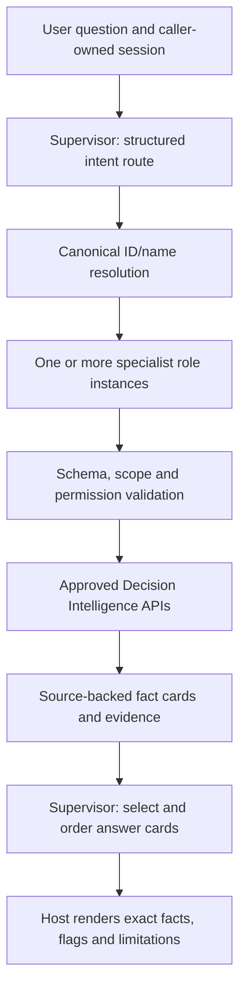

# Supervisor and specialist agents

The agent layer is plain Python using the installed OpenAI Python SDK. There is
no LangGraph/ADK/Agents SDK dependency, new graph query, file retrieval tool,
SQL/Cypher generation or change to deterministic business calculations.

## Architecture



The six `SpecialistAgent` instances share orchestration code but have distinct
roles, prompts, structured schemas and tool permissions:

| Specialist | Only permitted tools |
|---|---|
| vendor360 | get_vendor_360 |
| renewal | get_renewal_priorities, get_renewal_context |
| risk_dependency | get_vendor_dependency_risk |
| rationalization | get_vendor_rationalization_opportunities |
| spend_forecast | get_spend_forecast_analysis |
| what_if | run_workforce_scenario |

The supervisor can route to multiple specialists. All plans are validated before
any deterministic service executes. Limits: six specialist roles, four planned
calls per role, eight tool calls per turn, twelve underlying Decision Intelligence
calls by default, 2,000 question characters. There are no recursive handoffs or
model tool loops. Default maximum model requests is eight (route + six specialists
+ synthesis); SDK retries are disabled and each request times out after 30 seconds.

## Configuration and use

`OPENAI_API_KEY` is read only from the process environment at first model use.
No dotenv file or credential file is read. `OPENAI_MODEL` overrides the single
default `gpt-4.1-nano-2025-04-14`. The adapter uses the official API endpoint,
strict JSON-schema responses, bounded output (default 1,800 tokens/request), a
60,000-character input/schema budget and `store=False`. Failures are sanitized.
The model must support Chat Completions and strict structured outputs.

The optional SDK dependency is declared separately in `requirements-agents.txt`.
The base `pyproject.toml`/`uv.lock` dependency set stays unchanged. No package was
installed during this implementation. For a fresh environment, run the base
project setup first, then install the optional requirements when agents are needed:

```powershell
.venv\Scripts\python.exe -m pip install -r requirements-agents.txt
```

An exact base `uv sync` may remove this optional package; install the optional
requirements after syncing. This separation keeps the offline graph/query layer
usable without an OpenAI dependency.

```python
from citi_project.services.agents import (
    ConversationState, OpenAIJsonModel, SupervisorAgent,
)

# decision is the existing DecisionIntelligenceService, optionally with live graph.
model = OpenAIJsonModel()
supervisor = SupervisorAgent(decision, model)
state = ConversationState()  # one per user/session; do not share across users
try:
    result = supervisor.ask("What do we know about V-005?", state=state)
    follow_up = supervisor.ask("What about its workforce?", state=state)
    print(follow_up["final_answer"])
finally:
    model.close()
```

The existing deterministic graph Ask layer is not replaced or silently changed.
This phase exposes a separate higher-level `SupervisorAgent.ask()` entry point.
There is no UI, server/session registry, persisted conversation or external action.

## Contracts and grounding

The result contains `namespace`, `status`, `intent`, `resolved_entities`,
`specialists_used`, `tool_results`, `facts`, `calculations`, `flags`, `evidence`,
`interpretation`, `assumptions`, `limitations`, `selected_fact_ids`, `final_answer`
and `prompt_version`. Early clarification/error results have no selected fact IDs.
Status is answered, clarification, not_found, unsupported or unavailable.

Each tool result retains the original deterministic response, executed arguments,
specialist and tool ID. Fact cards contain exact host-rendered statements, tool
IDs, source JSON paths and evidence IDs. Evidence IDs resolve to original
structured records, graph relationships and document citations in the response.
Calculated facts remain in the source response even when a capability has an
empty explicit calculations array.

The LLM selects and orders fact-card IDs, not arbitrary prose or numeric values.
The host renders all factual sentences, deterministic flags, assumptions and
limitations. Unsupported synthesis fields, fabricated fact IDs and incomplete
model responses trigger a source-backed rendering fallback. At least one card
from each executed tool is retained. Required coverage adds all returned expiry
cards, material overview/risk/SLA sections, comparable spend calculations and
scenario baselines even if the model omits them. Interpretation is explicitly limited to
decision context, with no final renewal/consolidation/staffing recommendation.
This is intentionally more constrained than free-form LLM prose; routing and
relevance selection still require model evaluation.

The synthesis context includes up to three evidence references per card, with at
most two compact stored citations per evidence source. Full original evidence remains in
`tool_results` and the response evidence ledger. Portfolio overlap offers only
the first three example pairs for synthesis and reports that limit. No document
page or reference is invented. Stale/Missing risk, representative workforce,
synthetic/unverified sources, unavailable cost impact and unavailable numerical
causes remain deterministic limitations and cannot be suppressed by synthesis.

## Resolution and follow-ups

Canonical IDs and full vendor names are matched case-insensitively against the
validated master. A unique full-name match is accepted. Partial names—even a
unique partial match—produce clarification; unknown names/IDs return not_found.
The model's entity mentions must appear verbatim in the question. It cannot
substitute an invented ID. Explicit new entities override the active session ID.
Unresolved explicit entities clear old context. Portfolio/multi-vendor results
do not establish a single active vendor. No long-term memory is created.

Caller-owned `ConversationState` stores only the active vendor ID. Scenario
filters and previous tool outputs are not persisted; restate scenario filters in
follow-ups. Multiple explicit vendors must all be covered by the validated plan.

## Scenario integration

Percentages are passed through to the existing scenario service. They are never
recomputed by the model. A count request such as "shift two India contractors"
uses a bounded wrapper: run a read-only 100% overlay to obtain eligible IDs,
select the first requested count, then run the existing scenario with those IDs
and 100% of that selected cohort. Both service calls count against the service
budget. Excess counts or conflicting count/percentage inputs require clarification.
This adds no cost formula and changes no baseline data.

The final result identifies selected IDs and explains that 100% refers to the
selected cohort, not all India assignments. Geographic/category targets and IDs
must be grounded in the question. Write requests are unsupported; actual staffing
changes cannot be executed through these tools.

## Scripted demo results

These results use scripted model outputs and canonical graph doubles. They test
orchestration, grounding and deterministic values; they are not evidence of live
natural-language routing accuracy. Defaults use snapshot date 2026-09-28.

| # | Question | Specialist(s) | Grounded result |
|---|---|---|---|
| 1 | What do we know about V-001? | vendor360 | Aurelix Codeworks; CTR-001; 4 applications, 4 assignments; Current/High source risk; August SLA breach |
| 2 | Which contracts expire in the next 90 days? | renewal | V-005/018/009/007/013/001 at 15/30/45/60/75/90 days |
| 3 | How dependent are we on V-009? | risk_dependency | 4 supported applications, 1 service, 4 representative assignments; Stale risk |
| 4 | What is missing for V-017? | risk_dependency | Missing risk assessment; no inferred tier; evidence limitation preserved |
| 5 | Where can we simplify the vendor footprint? | rationalization | 70 potential overlap pairs; no consolidation recommendation |
| 6 | Candidates in ORG-01 | rationalization | 10 potential pairs |
| 7 | Why is V-005 above budget? | spend_forecast | FY Forecast variance USD +294,920.56 / +11.41%; no rate/volume causal inference |
| 8 | V-009 Actual vs YTD Budget | spend_forecast | USD +399,452.04 / +12.00%; comparable January–August periods |
| 9 | How many India assignments? | what_if | 13 representative assignments, not enterprise headcount |
| 10 | Reduce India contractors by 20% | what_if | 4 eligible; 1 affected after rounding; 3 remain; effective 25%; financial impact unavailable |
| 11 | Shift two India contractors to consultants | what_if | ASN-001-002 and ASN-004-002; 2 affected; portfolio total 60 unchanged; financial impact unavailable |
| 12 | Renewal, risk and spend for V-009 | renewal + risk_dependency + spend_forecast | 45 days to expiry; Stale risk, SLA breach; FY forecast variance +13.39%, YTD actual variance +12.00% |
| 13 | What do we know about Aurelix Codeworks? | vendor360 | Exact canonical resolution to V-001 |
| 14 | What about its workforce? after V-005 | vendor360 | Retains V-005; 3 representative assignments |
| 15 | Ambiguous Services / unknown vendor | none executed | Clarification with canonical candidates / not_found; no guessed ID |

## Tests and operational limits

```powershell
.venv\Scripts\python.exe -B -m pytest tests/test_agent_routing.py tests/test_agent_guardrails.py tests/test_openai_agent_model.py -q -p no:cacheprovider
.venv\Scripts\python.exe -B -m pytest -q -p no:cacheprovider
# Explicit opt-in; requires environment key and incurs model usage:
.venv\Scripts\python.exe -B -m pytest tests/integration/test_openai_agents.py --openai-integration -q -rs -p no:cacheprovider
```

Offline tests do not need credentials or a network connection. They use scripted
JSON model outputs, canonical graph doubles and a mocked SDK transport. Optional
live tests evaluate the real OpenAI route/plan/synthesis against synthetic graph
doubles, not live Neo4j. A separate end-to-end deployment test with both backends
is still needed. No live test initializes schema, ingests data or writes graph data.

Implementation validation: **61 new offline tests passed**; full suite **416 passed,
5 skipped** (two existing Neo4j tests and three opt-in OpenAI tests). Explicitly
running the three OpenAI tests with `--openai-integration` also skipped them because
`OPENAI_API_KEY` was not visible to this session's Python process. The SDK was
installed (3.22.1); no authentication or live routing success is claimed. All
eight protected dataset/mapping SHA-256 hashes match their existing generation
report. No deterministic service, CSV, mapping, ontology or ingestion file was
changed by this implementation.

There are no file, shell, SQL, Cypher, email or write tools available to specialists.
Input action checks and prompts supplement (not replace) the enforced whitelist.
No prompt can add tool permissions. Read-only scope mistakes/relevance errors
remain possible with an LLM; executed arguments and source facts are auditable.
Source text is untrusted data, and the model cannot author final factual prose.

Before UI/demo integration: validate real-model routing on the complete question
set, choose a session store with user isolation and expiry, add cancellation and
latency handling, approve data disclosure/logging policies, and measure evidence
coverage and answer relevance. A shared atomic CSV/graph snapshot is still absent.
Before actions or recommendations: approve business policies and introduce a
separate authorization boundary; this POC intentionally has neither.

API implementation references: [OpenAI Structured Outputs](https://developers.openai.com/api/docs/guides/structured-outputs)
and [GPT-4.1 nano model documentation](https://developers.openai.com/api/docs/models/gpt-4.1-nano).
